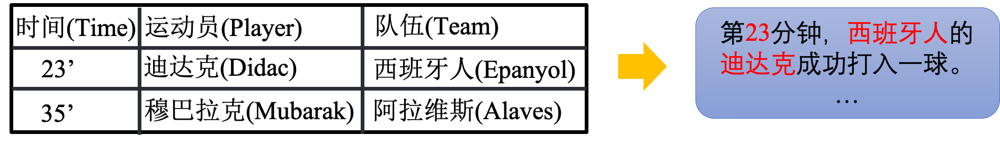
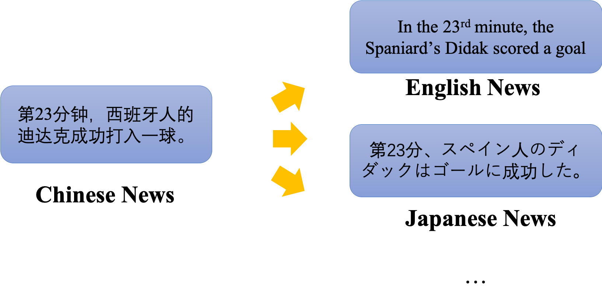
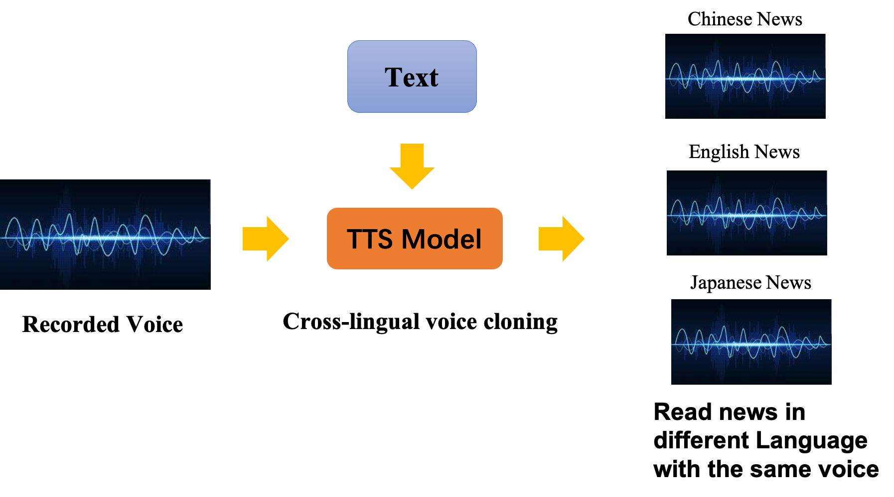
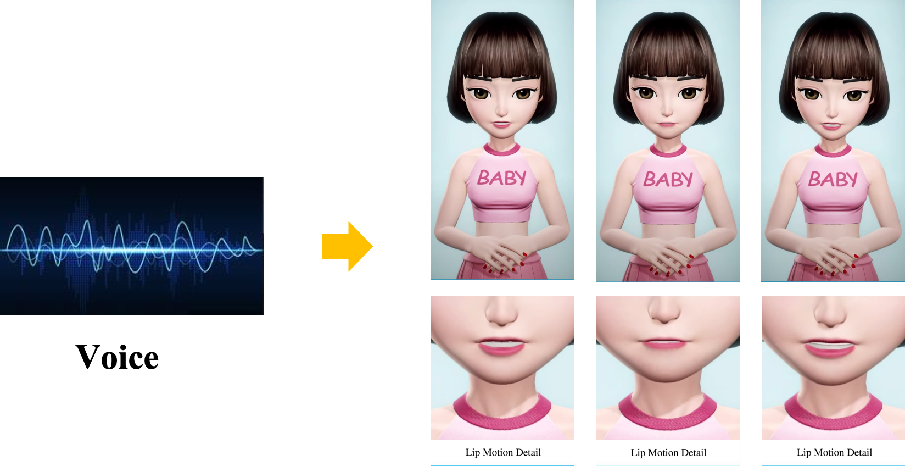

### Introduction

Xiaomingbot is an automated system to generate and read news articles. It employs text generation algorithms to generate news from data and machine translation algorithms to translate the text into multiple languages. The system produces a visual avatar to read the news, with facial expression and lip motion synchronized with automatically generated voice.

### Demo Video



### News Generation

Xiaomingbot takes a table as input，for example, a table that describes the score of each player in a soccer game.
To generate news, Xiaomingbot use templated-based table-to-text methods.
That is, we have many different templates to generate sentences for the news.
Every time Xiaomingbot generate a sentence, she randomly pick up a template and replace the placeholders with the according content in the input table.
To generate the news abstract, Xiaomingbot use a BERT-based model to score sentences in the news and pick up those achieving high score to make up the final abstract.

### News Translation

Xiaomingbot uses a Transformer-based machine translation model to translate the generated news in chinese into different languages, so that people around the world can read the news conveniently.
Although it can already generate fluent translated news, some certain proper nouns are still hard to translate because it may be confusing for the translation model.
Therefore, Xiaomingbot also use named entity replacement mechanism, that is, directly replace the named entitie with its according translation.
To accelerate the decoding process, we implement a faster CUDA-based NMT system, whose inference speed is ten times than tensorflow, and it can be found [Here](https://github.com/bytedance/byseqlib).

### News Reading

With a small amount of recorded voice of a speaker in one language provided as training data, we can train a TTS model for Xiaomingbot.
This TTS model has a cross-lingual voice cloning mechanism.
In detail, after training, it can read news in different language with exactly the same voice as we provided before.

### Avatar Animation

Xiaomingbot can generate lip motion synced with the audio synthesized by the TTS model, and render hairs, clothing, etc.
For lip motion, we use a Seq2Seq model.
The input sequence is the phoneme and the according duration drawn from the TTS model, and the ouput is a sequence of mouth blendshape weights.
With these different mouth blendshape weights, Xiaomingbot can make a lot of different facial expressions.
For other rendering, we use Unity and different algorithms like normal mapping.

### Our Paper

You can find our paper [here](https://www.aclweb.org/anthology/2020.acl-demos.1.pdf). If you want to cite our paper, you can cite:

    @inproceedings{xu-etal-2020-xiaomingbot,
        title = "{X}iaomingbot: {A} {M}ultilingual {R}obot {N}ews {R}eporter",
        author = "Xu, Runxin  and
          Cao, Jun  and
          Wang, Mingxuan  and
          Chen, Jiaze  and
          Zhou, Hao  and
          Zeng, Ying  and
          Wang, Yuping  and
          Chen, Li  and
          Yin, Xiang  and
          Zhang, Xijin  and
          Jiang, Songcheng  and
          Wang, Yuxuan  and
          Li, Lei",
        booktitle = "Proceedings of the 58th Annual Meeting of the Association 
            for Computational Linguistics: System Demonstrations",
        month = jul,
        year = "2020",
        address = "Online",
        publisher = "Association for Computational Linguistics",
        pages = "1--8"
    }
